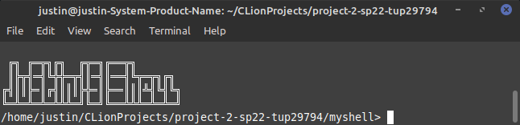
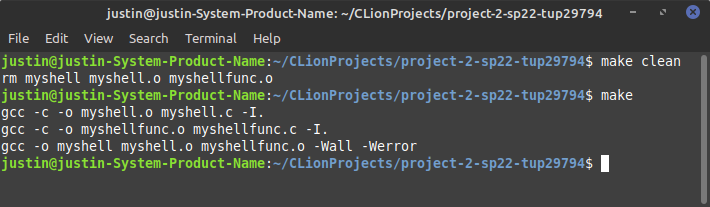

# Project 2-SP22: Developing a Linux Shell




- Justin Gallagher, Project 2: The C Shell
- Due Mar 23 by 1pm Points 8.6
- Submitting a file upload Available Jan 25 at 6pm - Apr 27 at 11:59pm 3 months
- CIS 3207, Section 004 //Spring 2022 //Instructor: Professor Gene Kwatny

**The full Project 2 description is [here](https://github.com/CIS-3207/Project-2-Fall21/blob/main/Project%202%20Developing%20a%20Linux%20Shell.pdf)**.
# Installation (Using the make file)


- Using ```prompt> ./>make clean``` will remove the following files from the unpackDirectory. This should be completed first to ensure there are no leftover files in the directory 
  - rm myshell myshell.o myshellfunc.o
- Using ```prompt> ./>make``` will compile the .c file using the following flags 'Wall and Werror'
  - gcc -c -o myshell.o myshell.c -I.
  - gcc -c -o myshellfunc.o myshellfunc.c -I.
  - gcc -o myshell myshell.o myshellfunc.o -Wall -Werror

#Usage
**Interactive Mode**

The shell can be invoked with either no arguments (interactive). Here is the no-argument way:
- >prompt> ./myshell 

At this point, myshell is running, and ready to accept commands. Type away!

**Batch Mode**

- >prompt> ./myshell batch.txt

The shell was also be invokes with a single argument (batch0; anything else is an error. There is a difference between batch and interactive modes: in interactive mode, a prompt is printed
(myshell> ). In batch mode, no prompt should be printed during execution of commands.

 
# Program Specifications
### Basic Supported Shell Commands:
- a. cd <directory> - Change the current default directory to
<directory>. If the <directory> argument is not present, report the current directory. If the directory does not exist an appropriate error should be reported. This command should also change the PWD environment variable.  
- b. clr - Clear the screen.  
- c. dir <directory> - List the contents of directory <directory>.  
- d. environ - List all the environment strings.  
- e. echo <comment> - Display  <comment> on the display followed by a new line (multiple spaces/tabs may be reduced to a single space).  
- f. help - Display the user manual using the more filter.   
- g. pause - Pause operation of the shell until ‘Enter’ is pressed.  
- h. quit - Quit the shell.  

# Custom Modifiers
Piping
- A pipe is a form of redirection (transfer of standard output to some other destination) that is used in Linux and other Unix-like operating systems to send the output of one command/program/process to another command/program/process for further processing.
        usage:
        myshell> command_1 | command_2 | command_3 | .... | command_N

Background
- An ampersand (&) at the end of the command line indicates that the shell should return to the command line prompt immediately after launching that program.
        usage:
        
          myshell> command_1 & command_2 & command_3 &
              This will execute three commands.
                  command_1 will run in the background
                  command_2 will run in the background
                  command_3 will run in the background

          myshell> command_1 & command_2 & command_3
              This will execute three commands.
                  command_1 will run in the background
                  command_2 will run in the background
                  command_3 will run in the foreground

I/O Redirection
- The ‘<‘ symbol is used for input(STDIN) redirection
- The ‘>‘ symbol is used for output (STDOUT) redirection.
- If you do not want a file to be overwritten but want to add more content to an existing file, then you should use ‘>>‘ operator.